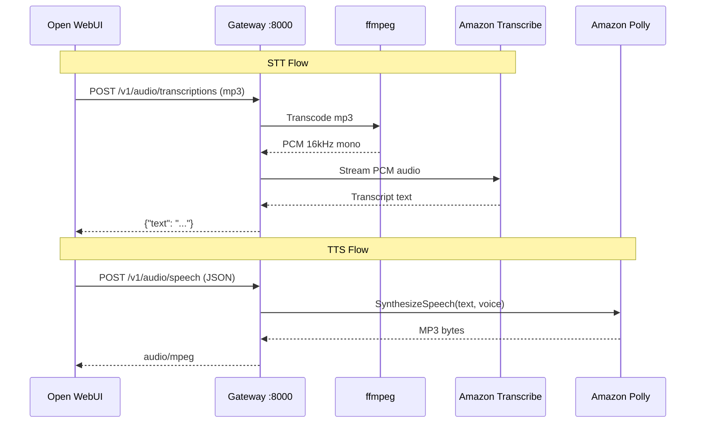

# Open-WebUI Bedrock Audio Gateway

[](LICENSE)

OpenAI-compatible audio gateway for [Open WebUI](https://github.com/open-webui/open-webui) using Amazon Transcribe (STT) and Amazon Polly (TTS).

## Why Polly + Transcribe Instead of Nova Sonic?

Amazon Nova Sonic is AWS's speech-to-speech foundation model available through Amazon Bedrock. It's impressive — it unifies speech understanding and generation into a single model with low latency. So why not use it here?

- **Nova Sonic is a conversational model, not a STT/TTS API.** It's designed for real-time, bidirectional voice conversations (think voice agents), not for the discrete "transcribe this file" and "speak this text" operations that Open WebUI needs. Open WebUI sends a recorded audio file for transcription and a text string for synthesis — two separate, stateless requests. Nova Sonic's bidirectional streaming API doesn't map to that workflow.
- **No drop-in replacement for the OpenAI audio endpoints.** Open WebUI expects `POST /v1/audio/transcriptions` (file in, text out) and `POST /v1/audio/speech` (text in, audio out). Nova Sonic uses `InvokeModelWithBidirectionalStream`, a persistent streaming channel where audio flows both ways simultaneously. Wrapping that into two independent request/response endpoints would add significant complexity for no real benefit.
- **Polly and Transcribe are purpose-built.** Amazon Transcribe is optimized for speech-to-text with support for many languages, custom vocabularies, and streaming PCM input. Amazon Polly is optimized for text-to-speech with dozens of voices, multiple engines (generative, neural, standard), and SSML support. They do their respective jobs well and are straightforward to integrate.

Nova Sonic is the right choice if you're building a voice agent or real-time conversational AI. For Open WebUI's audio needs — discrete STT and TTS calls — Polly and Transcribe are the better fit.

## Architecture



## Prerequisites

- Python 3.12+
- [uv](https://docs.astral.sh/uv/getting-started/installation/) (Python package manager)
- ffmpeg (`brew install ffmpeg` on macOS, `apt install ffmpeg` on Ubuntu)
- AWS credentials with access to Amazon Transcribe and Amazon Polly

### IAM Permissions

The AWS credentials (IAM user, role, or instance profile) need the following permissions:

```json
{
  "Version": "2012-10-17",
  "Statement": [
    {
      "Effect": "Allow",
      "Action": [
        "transcribe:StartStreamTranscription"
      ],
      "Resource": "*"
    },
    {
      "Effect": "Allow",
      "Action": [
        "polly:SynthesizeSpeech",
        "polly:DescribeVoices"
      ],
      "Resource": "*"
    }
  ]
}
```

`polly:DescribeVoices` is used to dynamically fetch the available voices for the configured engine. If this permission is missing, the gateway falls back to a built-in voice list and still works — but adding it ensures new voices appear automatically.

## Setup

```bash
cp .env.example .env
# Edit .env — set GATEWAY_API_KEY and optionally AWS credentials
```

## Run Locally

Requires Python 3.12+, [uv](https://docs.astral.sh/uv/getting-started/installation/), and ffmpeg.

```bash
# Install uv (if needed)
curl -LsSf https://astral.sh/uv/install.sh | sh

# Install dependencies
uv sync

# Start the server
make run
```

The server starts on `http://0.0.0.0:8000` (configurable via `GATEWAY_HOST` and `GATEWAY_PORT` in `.env`).

## Run with Docker Compose

Requires Docker and Docker Compose. No Python or ffmpeg needed on the host.

```bash
# Build and start
make docker-up

# Or explicitly
docker compose up --build -d

# Check status
docker compose ps

# View logs
docker compose logs -f

# Stop
make docker-down
```

## Run with Pre-built Image

Pull the latest image from GitHub Container Registry — no build required:

```bash
docker run -d \
  --name audio-gateway \
  -p 8000:8000 \
  --env-file .env \
  ghcr.io/dinnouti/open-webui-bedrock-audio-gateway:latest
```

Or in a `docker-compose.yml`:

```yaml
services:
  audio-gateway:
    image: ghcr.io/dinnouti/open-webui-bedrock-audio-gateway:latest
    ports:
      - "8000:8000"
    env_file:
      - .env
    restart: unless-stopped
```

## Testing

```bash
# Run smoke tests locally (starts/stops server automatically)
make test

# Run smoke tests against Docker Compose
make test-docker
```

## Open WebUI Configuration

In Open WebUI Admin → Settings → Audio:

**Speech-to-Text:**
- Engine: `OpenAI (Compatible)`
- API Base URL: `http://<gateway-host>:8000/v1`
- API Key: your `GATEWAY_API_KEY` value from `.env`
- Model: anything (the gateway uses Amazon Transcribe regardless)

**Text-to-Speech:**
- Engine: `OpenAI (Compatible)`
- API Base URL: `http://<gateway-host>:8000/v1`
- API Key: your `GATEWAY_API_KEY` value from `.env`
- Model and Voice: pick from the dropdowns (populated by the gateway)

> **Note:** The voice selected in Open WebUI's dropdown is what gets sent in each request. The `DEFAULT_VOICE_ID` in `.env` is only used as a fallback when the request doesn't include a voice.

## Endpoints

| Endpoint | Method | Auth | Description |
|---|---|---|---|
| `/v1/audio/transcriptions` | POST | Bearer token | STT — transcribe audio via Amazon Transcribe |
| `/v1/audio/speech` | POST | Bearer token | TTS — synthesize speech via Amazon Polly |
| `/v1/audio/models` | GET | None | List available TTS models |
| `/v1/audio/voices` | GET | None | List available Polly voices |
| `/health` | GET | None | Liveness probe for load balancers |

Interactive API docs are available at `/docs` (Swagger UI) and `/redoc` (ReDoc) when the server is running.

### API Examples

**Transcribe audio (STT):**

```bash
curl -X POST http://localhost:8000/v1/audio/transcriptions \
  -H "Authorization: Bearer YOUR_API_KEY" \
  -F "file=@recording.mp3" \
  -F "model=transcribe"
```

Response:
```json
{"text": "Hello, how are you?"}
```

**Synthesize speech (TTS):**

```bash
curl -X POST http://localhost:8000/v1/audio/speech \
  -H "Authorization: Bearer YOUR_API_KEY" \
  -H "Content-Type: application/json" \
  -d '{"input": "Hello, how are you?", "voice": "Matthew"}' \
  --output speech.mp3
```

Response: raw `audio/mpeg` bytes.

**List voices:**

```bash
curl http://localhost:8000/v1/audio/voices
```

Response:
```json
{
  "voices": [
    {"id": "Matthew", "name": "Matthew (en-US, Male)"},
    {"id": "Joanna", "name": "Joanna (en-US, Female)"},
    ...
  ]
}
```

## Environment Variables

| Variable | Default | Required | Description |
|---|---|---|---|
| `AWS_ACCESS_KEY_ID` | _(none)_ | No | AWS access key. Falls back to standard credential chain if empty |
| `AWS_SECRET_ACCESS_KEY` | _(none)_ | No | AWS secret key. Same fallback behavior |
| `AWS_REGION` | `us-east-1` | No | AWS region for Transcribe and Polly |
| `GATEWAY_API_KEY` | — | **Yes** | Bearer token for authenticating requests |
| `GATEWAY_HOST` | `0.0.0.0` | No | Listen host |
| `GATEWAY_PORT` | `8000` | No | Listen port |
| `LOG_FORMAT` | `console` | No | `console` for dev, `json` for production |
| `LOG_LEVEL` | `INFO` | No | `DEBUG`, `INFO`, `WARNING`, `ERROR`. Use `DEBUG` to see Polly/Transcribe text |
| `TRANSCRIBE_LANGUAGE_CODE` | `en-US` | No | BCP-47 language code (e.g. `en-US`, `fr-FR`, `de-DE`). See [supported languages](https://docs.aws.amazon.com/transcribe/latest/dg/supported-languages.html) |
| `MAX_FILE_SIZE_MB` | `25` | No | Max upload size for audio files |
| `DEFAULT_VOICE_ID` | `Matthew` | No | Fallback Polly voice when request doesn't specify one |
| `POLLY_ENGINE` | `generative` | No | Polly engine: `generative`, `neural`, or `standard` |
| `TRANSCRIBE_TIMEOUT_SECONDS` | `30` | No | Timeout for a single transcription attempt |
| `POLLY_TIMEOUT_SECONDS` | `15` | No | Read timeout for Polly API calls |
| `MAX_RETRIES` | `2` | No | Retry count for transient AWS errors |
| `RETRY_BASE_DELAY` | `0.5` | No | Base delay (seconds) for exponential backoff |
| `RATE_LIMIT` | `60/minute` | No | Rate limit per client IP (slowapi format) |
| `MAX_REQUEST_BYTES` | `26214400` | No | Max request body size in bytes. `0` to disable |

## Troubleshooting

**Wrong voice is playing:**
The voice comes from Open WebUI's TTS settings dropdown, not from `DEFAULT_VOICE_ID` in `.env`. Change it in Open WebUI Admin → Settings → Audio → Voice.

**403 "Not authenticated":**
Missing `Authorization: Bearer <key>` header. Make sure the API key in Open WebUI matches `GATEWAY_API_KEY` in `.env`.

**401 "Invalid API key":**
The Bearer token doesn't match `GATEWAY_API_KEY`. Check for trailing whitespace or copy-paste issues.

**502 "Transcription failed":**
AWS credentials are missing or don't have `transcribe:StartStreamTranscription` permission. Check your IAM policy and that credentials are configured (`.env`, env vars, or instance profile).

**502 "Speech synthesis failed":**
Same as above but for Polly. Verify `polly:SynthesizeSpeech` permission.

**400 "Unsupported audio format" / "Audio transcoding timed out":**
ffmpeg can't process the uploaded file. Verify ffmpeg is installed (`ffmpeg -version`) and the file is a valid audio format.

**429 "Rate limit exceeded":**
Too many requests from the same IP. Adjust `RATE_LIMIT` in `.env` (default: `60/minute`).

**Logs show no debug output:**
Set `LOG_LEVEL=DEBUG` in `.env` and restart. This enables full text logging for Polly input and Transcribe output.

**Transcribe returns empty text:**
The audio may be silent or too short. This is not an error — the gateway returns `{"text": ""}`. Check the audio file.

## Roadmap

- **Merge with [Bedrock Access Gateway](https://github.com/aws-samples/bedrock-access-gateway)** — Combine this audio gateway with the Bedrock Access Gateway to provide a single, unified OpenAI-compatible API that covers both LLM chat/completions and audio (STT/TTS). Instead of running two separate services, Open WebUI would point at one gateway for everything.

- **AWS container deployment (Fargate / ECS / EKS)** — Provide production-ready deployment options for running the gateway on AWS container services.
